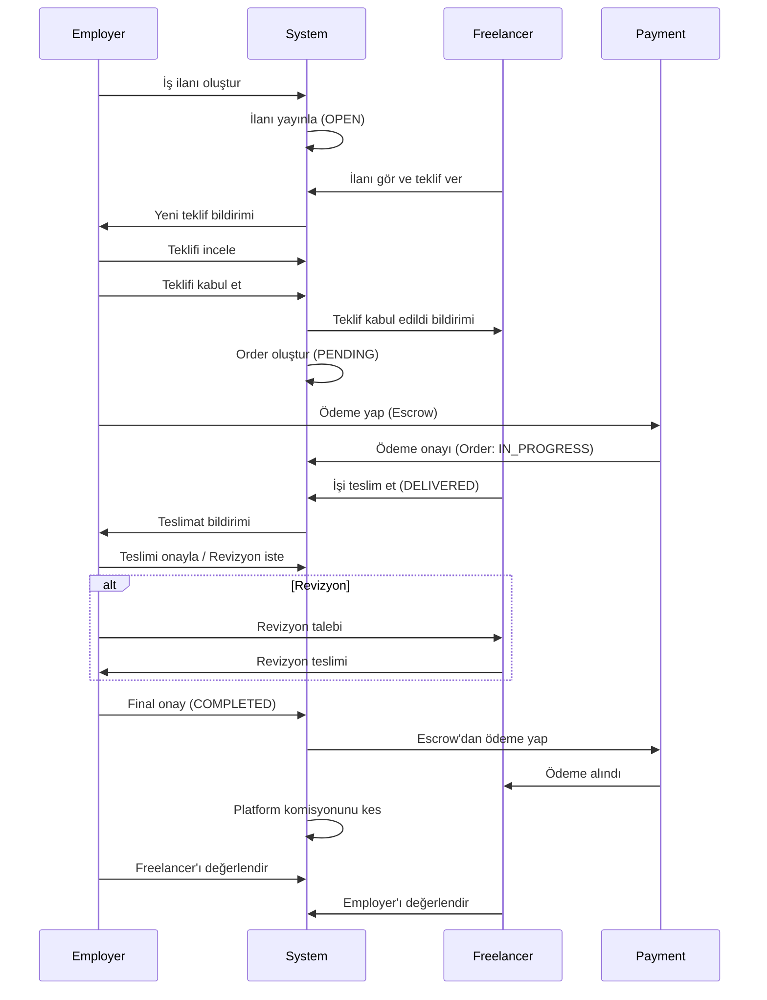
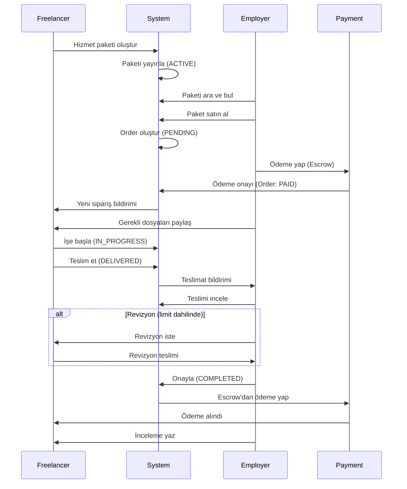
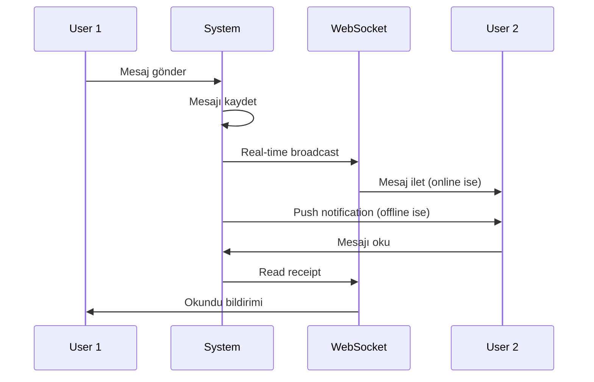

# Proje Analizi - MarifetBul Platform

> **Dokümantasyon**: 01 - Proje Analizi  
> **Versiyon**: 1.0.0  
> **Tarih**: Ekim 2025

---

## 📋 İçindekiler

1. [Platform Özeti](#platform-özeti)
2. [Fonksiyonel Gereksinimler](#fonksiyonel-gereksinimler)
3. [Kullanıcı Tipleri ve Roller](#kullanıcı-tipleri-ve-roller)
4. [Temel İş Akışları](#temel-iş-akışları)
5. [Frontend-Backend Entegrasyon](#frontend-backend-entegrasyon)
6. [Use Case Diyagramları](#use-case-diyagramları)
7. [Veri Akış Diyagramları](#veri-akış-diyagramları)
8. [Non-Functional Requirements](#non-functional-requirements)

---

## 🎯 Platform Özeti

### Platform Tipi

**MarifetBul** - Türkiye merkezli, iki taraflı (two-sided) freelance marketplace platformu.

### Temel İş Modeli

```
Employer (İşveren) ←→ Platform ←→ Freelancer (Serbest Çalışan)

İş Akışı 1: Job-Based (İş İlanı Bazlı)
- Employer iş ilanı açar
- Freelancer'lar teklif verir
- Employer teklifi kabul eder
- İş tamamlanır ve ödeme yapılır

İş Akışı 2: Package-Based (Paket Bazlı)
- Freelancer hizmet paketi oluşturur
- Employer paketi satın alır
- Freelancer hizmeti teslim eder
- Ödeme otomatik gerçekleşir
```

### Platform Hedefleri

1. **Güvenli İşlem**: Escrow (emanet) sistemi ile güvenli ödeme
2. **Kaliteli Eşleşme**: Beceri ve deneyim bazlı eşleştirme algoritması
3. **Şeffaf İletişim**: Entegre mesajlaşma ve dosya paylaşımı
4. **İtibar Sistemi**: Review ve rating bazlı güvenilirlik
5. **Ölçeklenebilirlik**: Mikroservis mimarisine geçiş hazır

---

## 📊 Fonksiyonel Gereksinimler

### 1. Kullanıcı Yönetimi (User Management)

#### 1.1 Kayıt ve Giriş (Authentication)

- **Çok adımlı kayıt** (Multi-step registration)
  - Adım 1: Email, şifre, kullanıcı tipi
  - Adım 2: Kişisel bilgiler (ad, soyad, telefon)
  - Adım 3: Profil detayları (başlık, beceriler, lokasyon)
  - Adım 4: Opsiyonel bilgiler (portfolyo, referanslar)

- **Giriş Yöntemleri**
  - Email/Şifre (temel)
  - Remember Me (kalıcı oturum)
  - "Şifremi Unuttum" (password reset)
  - Social Login (gelecek: Google, LinkedIn)

- **Oturum Yönetimi**
  - JWT token bazlı authentication
  - Token refresh mekanizması
  - Multi-device login desteği
  - Oturum süresi: 7 gün (remember me: 30 gün)

#### 1.2 Profil Yönetimi

```
Freelancer Profili:
├── Temel Bilgiler: Ad, soyad, email, telefon, avatar
├── Profesyonel Bilgiler: Başlık, bio, deneyim seviyesi
├── Beceriler: İlgili kategorilerden seçim + custom
├── Portfolyo: Proje örnekleri (resim, açıklama, link)
├── Eğitim: Okul, bölüm, mezuniyet yılı
├── Sertifikalar: Sertifika adı, kurum, tarih
├── Diller: Dil + seviye
├── Çalışma Tercihleri: Saatlik ücret, müsaitlik, uzaktan çalışma
└── İstatistikler: Rating, tamamlanan iş, kazanç

Employer Profili:
├── Temel Bilgiler: Ad, soyad, email, telefon, avatar
├── Şirket Bilgileri: Şirket adı, büyüklük, sektör, website
├── Lokasyon: Şehir, ülke
├── Bütçe: Toplam harcama, ortalama proje bütçesi
└── İstatistikler: Rating, aktif iş, tamamlanan iş
```

#### 1.3 Email Doğrulama ve KYC

- Email verification (kayıt sonrası zorunlu)
- Telefon doğrulama (opsiyonel, güven artırıcı)
- Kimlik doğrulama (KYC - yüksek limitlere ulaşmak için)
- Verification badge sistemi

### 2. İş ve Paket Yönetimi (Marketplace)

#### 2.1 İş İlanları (Jobs)

**Job Lifecycle:**

```
1. DRAFT → İşveren tarafından oluşturuluyor
2. OPEN → Yayında, teklifler kabul ediliyor
3. IN_PROGRESS → Freelancer atandı, iş devam ediyor
4. REVIEW → İş teslim edildi, inceleme aşamasında
5. COMPLETED → İş tamamlandı, ödeme yapıldı
6. CANCELLED → İş iptal edildi
```

**Job Fields:**

```java
Job {
  id: UUID
  title: String (max 100 karakter)
  description: String (max 5000 karakter)
  category: Category (referans)
  subcategory: String
  skills: List<String>

  budget: {
    type: FIXED | HOURLY
    amount: BigDecimal
    maxAmount: BigDecimal (hourly için)
    currency: String (default: TRY)
  }

  timeline: String (e.g., "1 hafta", "2 ay")
  deadline: DateTime (optional)
  experienceLevel: BEGINNER | INTERMEDIATE | EXPERT

  location: {
    isRemote: Boolean
    city: String (optional)
    country: String (default: TR)
  }

  attachments: List<File> (max 5, 10MB each)
  requirements: List<String>
  tags: List<String>

  employerId: UUID
  freelancerId: UUID (atandıktan sonra)
  status: JobStatus

  proposalsCount: Integer
  viewsCount: Integer

  createdAt: DateTime
  updatedAt: DateTime
  expiresAt: DateTime (optional, otomatik close)
}
```

**Job Operations:**

- `POST /api/v1/jobs` - İş ilanı oluştur
- `GET /api/v1/jobs` - İş ilanlarını listele (filters, pagination)
- `GET /api/v1/jobs/{id}` - İş detayı
- `PUT /api/v1/jobs/{id}` - İş güncelle (sadece employer)
- `DELETE /api/v1/jobs/{id}` - İş sil
- `POST /api/v1/jobs/{id}/close` - İlanı kapat
- `GET /api/v1/jobs/my-jobs` - Benim işlerim

#### 2.2 Hizmet Paketleri (Service Packages)

**Package Structure:**

```
Package {
  id: UUID
  title: String
  description: String
  shortDescription: String (max 300 karakter)

  category: Category
  subcategory: String
  skills: List<String>
  tags: List<String>

  pricing: {
    basic: PackageTier
    standard: PackageTier (optional)
    premium: PackageTier (optional)
  }

  delivery: {
    estimatedDays: Integer
    expressAvailable: Boolean
    expressPrice: BigDecimal
    formats: List<String> (e.g., "PDF", "PSD", "AI")
  }

  features: List<String>
  requirements: List<String>

  images: List<ImageURL> (min 1, max 5)
  video: VideoURL (optional)

  freelancerId: UUID
  seller: FreelancerSummary

  statistics: {
    views: Integer
    orders: Integer
    rating: Float
    reviewCount: Integer
    completionRate: Float
    responseTime: Integer (dakika)
  }

  isActive: Boolean
  status: ACTIVE | PAUSED | DRAFT | REJECTED

  createdAt: DateTime
  updatedAt: DateTime
}

PackageTier {
  title: String (e.g., "Temel", "Standart", "Premium")
  price: BigDecimal
  description: String
  deliveryTime: Integer (gün)
  revisions: Integer
  features: List<String>
}
```

**Package Operations:**

- `POST /api/v1/packages` - Paket oluştur
- `GET /api/v1/packages` - Paketleri listele
- `GET /api/v1/packages/{id}` - Paket detayı
- `PUT /api/v1/packages/{id}` - Paket güncelle
- `DELETE /api/v1/packages/{id}` - Paket sil
- `POST /api/v1/packages/{id}/pause` - Paketi duraklat
- `POST /api/v1/packages/{id}/activate` - Paketi aktifleştir

### 3. Teklif ve Sipariş Yönetimi

#### 3.1 Teklifler (Proposals)

**Proposal Lifecycle:**

```
PENDING → ACCEPTED → (Order Created)
       → REJECTED
       → WITHDRAWN (Freelancer çekti)
```

**Proposal Fields:**

```
Proposal {
  id: UUID
  jobId: UUID
  job: JobSummary

  freelancerId: UUID
  freelancer: FreelancerProfile

  coverLetter: String (max 2000 karakter)
  proposedRate: BigDecimal
  deliveryTime: Integer (gün)

  milestones: List<Milestone> (optional)
  attachments: List<File> (optional)

  status: PENDING | ACCEPTED | REJECTED | WITHDRAWN

  createdAt: DateTime
  updatedAt: DateTime
  expiresAt: DateTime (7 gün)
}

Milestone {
  title: String
  description: String
  amount: BigDecimal
  dueDate: DateTime
  order: Integer
}
```

**Proposal Operations:**

- `POST /api/v1/proposals` - Teklif ver
- `GET /api/v1/proposals` - Teklifleri listele
- `GET /api/v1/proposals/{id}` - Teklif detayı
- `PUT /api/v1/proposals/{id}` - Teklifi güncelle
- `DELETE /api/v1/proposals/{id}` - Teklifi çek
- `POST /api/v1/proposals/{id}/accept` - Teklifi kabul et (employer)
- `POST /api/v1/proposals/{id}/reject` - Teklifi reddet

#### 3.2 Siparişler (Orders)

**Order Lifecycle:**

```
1. PENDING → Ödeme bekleniyor
2. PAID → Ödeme alındı, iş başlayabilir
3. IN_PROGRESS → Freelancer çalışıyor
4. DELIVERED → Freelancer teslim etti
5. REVISION_REQUESTED → Employer revizyon istedi
6. COMPLETED → Her iki taraf onayladı
7. CANCELLED → İptal edildi
8. DISPUTED → Anlaşmazlık
```

**Order Fields:**

```
Order {
  id: UUID
  orderNumber: String (unique, e.g., "MRF-2025-001234")

  // İlişkiler
  jobId: UUID (optional, job-based ise)
  packageId: UUID (optional, package-based ise)
  proposalId: UUID (optional, proposal-based ise)

  employerId: UUID
  freelancerId: UUID

  // Finansal
  amount: BigDecimal
  platformFee: BigDecimal (% bazlı komisyon)
  freelancerEarning: BigDecimal

  // Teslimat
  deliveryTime: Integer (gün)
  deliveryDate: DateTime
  actualDeliveryDate: DateTime

  revisions: {
    included: Integer
    used: Integer
    additional: Integer (ek ücretli)
  }

  // Milestone (aşama bazlı ödeme)
  milestones: List<OrderMilestone>

  // Dosyalar
  requirements: List<File> (employer'dan)
  deliverables: List<File> (freelancer'dan)

  status: OrderStatus

  // Notlar ve mesajlar
  notes: String
  conversationId: UUID (dedicated chat)

  createdAt: DateTime
  updatedAt: DateTime
  completedAt: DateTime
}

OrderMilestone {
  id: UUID
  title: String
  description: String
  amount: BigDecimal
  dueDate: DateTime
  status: PENDING | IN_PROGRESS | COMPLETED | CANCELLED
  completedAt: DateTime
}
```

**Order Operations:**

- `POST /api/v1/orders` - Sipariş oluştur
- `GET /api/v1/orders` - Siparişleri listele
- `GET /api/v1/orders/{id}` - Sipariş detayı
- `POST /api/v1/orders/{id}/deliver` - Teslim et
- `POST /api/v1/orders/{id}/request-revision` - Revizyon iste
- `POST /api/v1/orders/{id}/complete` - Onayla
- `POST /api/v1/orders/{id}/cancel` - İptal et
- `POST /api/v1/orders/{id}/dispute` - Anlaşmazlık aç

### 4. Mesajlaşma Sistemi (Messaging)

#### 4.1 Conversation Types

```
1. DIRECT: İki kullanıcı arası
2. GROUP: Çoklu katılımcı
3. SUPPORT: Destek talebi
4. ORDER: Sipariş bazlı özel chat
```

#### 4.2 Message Types

```
- TEXT: Standart metin
- IMAGE: Resim
- FILE: Dosya (PDF, DOC, etc.)
- VOICE: Ses kaydı
- VIDEO: Video dosyası
- LOCATION: Konum paylaşımı
- SYSTEM: Sistem mesajı (otomatik)
```

**Conversation Structure:**

```
Conversation {
  id: UUID
  type: ConversationType
  title: String (optional, group için)

  participants: List<ConversationParticipant>
  participantIds: List<UUID>

  lastMessage: Message
  unreadCount: Map<UUID, Integer> (kullanıcı başına)

  // İlişkili kaynak
  jobId: UUID (optional)
  orderId: UUID (optional)

  settings: {
    allowInvites: Boolean
    allowMediaSharing: Boolean
    maxParticipants: Integer
  }

  isArchived: Boolean
  isMuted: Boolean
  isPinned: Boolean

  createdAt: DateTime
  updatedAt: DateTime
}

Message {
  id: UUID
  conversationId: UUID

  senderId: UUID
  sender: UserSummary

  content: String
  type: MessageType

  attachments: List<FileAttachment>

  // Threading
  replyTo: UUID (optional, başka mesaja cevap)

  // Status
  isRead: Boolean
  readBy: Map<UUID, DateTime>
  isEdited: Boolean
  editedAt: DateTime

  // Reactions
  reactions: List<MessageReaction>

  sentAt: DateTime
  createdAt: DateTime
}

MessageReaction {
  userId: UUID
  emoji: String
  createdAt: DateTime
}
```

**Messaging Operations:**

- `GET /api/v1/conversations` - Konuşmaları listele
- `POST /api/v1/conversations` - Yeni konuşma başlat
- `GET /api/v1/conversations/{id}` - Konuşma detayı
- `GET /api/v1/conversations/{id}/messages` - Mesajları getir
- `POST /api/v1/conversations/{id}/messages` - Mesaj gönder
- `PUT /api/v1/messages/{id}` - Mesaj düzenle
- `DELETE /api/v1/messages/{id}` - Mesaj sil
- `POST /api/v1/messages/{id}/read` - Okundu işaretle
- `POST /api/v1/conversations/{id}/archive` - Arşivle

#### 4.3 Real-time Features

- **Typing Indicator**: Kullanıcı yazıyor göstergesi
- **Online Status**: Kullanıcı çevrimiçi durumu
- **Read Receipts**: Okundu bilgisi
- **Message Delivery**: İletildi durumu

### 5. Ödeme Sistemi (Payment)

#### 5.1 Escrow (Emanet) Sistemi

```
Akış:
1. Employer sipariş oluşturur
2. Ödeme platformdan escrow hesabına alınır
3. Freelancer işi teslim eder
4. Employer onaylar
5. Ödeme freelancer'a aktarılır
6. Platform komisyonu kesilir
```

#### 5.2 Payment Methods

- Kredi Kartı (Visa, Mastercard)
- Banka Transferi (EFT/Havale)
- Sanal Pos entegrasyonu (İyzico/PayTR)
- Wallet (platform içi cüzdan)

**Payment Structure:**

```
Payment {
  id: UUID
  orderId: UUID

  amount: BigDecimal
  currency: String (TRY, USD, EUR)

  method: PaymentMethod
  provider: String (e.g., "iyzico", "paytr")

  status: PaymentStatus
  transactionId: String (provider'dan)

  // Escrow
  escrowStatus: PENDING | HELD | RELEASED | REFUNDED
  escrowHeldAt: DateTime
  escrowReleasedAt: DateTime

  // Taraflar
  payerId: UUID (employer)
  payeeId: UUID (freelancer)

  // Komisyon
  platformFee: BigDecimal
  platformFeePercentage: Float

  // Ödeme detayları
  paymentDetails: JSON (kart bilgileri - encrypted)

  createdAt: DateTime
  completedAt: DateTime
}

enum PaymentStatus {
  PENDING,
  PROCESSING,
  COMPLETED,
  FAILED,
  REFUNDED,
  CANCELLED
}
```

**Payment Operations:**

- `POST /api/v1/payments/initiate` - Ödeme başlat
- `POST /api/v1/payments/confirm` - Ödeme onayla
- `POST /api/v1/payments/{id}/refund` - İade yap
- `GET /api/v1/payments/{id}` - Ödeme detayı
- `GET /api/v1/payments/history` - Ödeme geçmişi

### 6. İnceleme ve Değerlendirme (Reviews & Ratings)

**Review Structure:**

```
Review {
  id: UUID

  // Hedef
  targetType: USER | PACKAGE | JOB
  targetId: UUID

  // İlişki
  orderId: UUID
  reviewerId: UUID
  revieweeId: UUID

  // İçerik
  rating: Integer (1-5)
  title: String
  comment: String

  // Detaylı puanlama
  detailedRatings: {
    quality: Integer (1-5)
    communication: Integer (1-5)
    delivery: Integer (1-5)
    professionalism: Integer (1-5)
  }

  // Medya
  images: List<ImageURL>

  // Moderasyon
  status: PENDING | APPROVED | REJECTED | HIDDEN
  moderatedBy: UUID
  moderatedAt: DateTime
  moderationNote: String

  // İstatistik
  helpfulCount: Integer
  reportCount: Integer

  // Yanıt
  response: ReviewResponse (optional)

  createdAt: DateTime
  updatedAt: DateTime
}

ReviewResponse {
  content: String
  createdAt: DateTime
  updatedAt: DateTime
}
```

**Review Operations:**

- `POST /api/v1/reviews` - İnceleme yaz
- `GET /api/v1/reviews` - İncelemeleri listele
- `GET /api/v1/reviews/{id}` - İnceleme detayı
- `POST /api/v1/reviews/{id}/response` - İncelemeye yanıt ver
- `POST /api/v1/reviews/{id}/helpful` - Yararlı işaretle
- `POST /api/v1/reviews/{id}/report` - Rapor et

### 7. Blog ve İçerik Yönetimi

**Blog Post Structure:**

```
BlogPost {
  id: UUID
  slug: String (unique, URL-friendly)

  title: String
  excerpt: String
  content: String (Markdown)

  featuredImage: ImageURL

  author: UserSummary
  authorId: UUID

  category: Category
  tags: List<String>

  // SEO
  metaTitle: String
  metaDescription: String
  metaKeywords: List<String>

  // İstatistik
  views: Integer
  readTime: Integer (dakika)

  // Durum
  status: DRAFT | PUBLISHED | ARCHIVED
  publishedAt: DateTime

  // Etkileşim
  commentsEnabled: Boolean
  commentsCount: Integer

  createdAt: DateTime
  updatedAt: DateTime
}
```

### 8. Destek Sistemi (Support)

**Support Ticket Structure:**

```
SupportTicket {
  id: UUID
  ticketNumber: String (unique)

  userId: UUID
  user: UserSummary

  subject: String
  description: String
  category: TicketCategory
  priority: LOW | MEDIUM | HIGH | URGENT

  status: OPEN | IN_PROGRESS | WAITING_USER | RESOLVED | CLOSED

  // Atama
  assignedAgentId: UUID (optional)
  assignedAgent: AdminUser

  // İletişim
  responses: List<TicketResponse>

  // İlişkili
  relatedOrderId: UUID (optional)
  relatedJobId: UUID (optional)

  attachments: List<File>

  // Takip
  firstResponseAt: DateTime
  resolvedAt: DateTime
  closedAt: DateTime

  createdAt: DateTime
  updatedAt: DateTime
}

TicketResponse {
  id: UUID
  ticketId: UUID

  authorId: UUID
  author: UserSummary
  isStaff: Boolean

  content: String
  attachments: List<File>

  isInternal: Boolean (sadece admin görsün)

  createdAt: DateTime
}
```

### 9. Bildirim Sistemi (Notifications)

**Notification Types:**

```
- NEW_MESSAGE: Yeni mesaj
- NEW_PROPOSAL: Yeni teklif
- PROPOSAL_ACCEPTED: Teklif kabul edildi
- PROPOSAL_REJECTED: Teklif reddedildi
- ORDER_CREATED: Yeni sipariş
- ORDER_DELIVERED: Teslimat yapıldı
- ORDER_COMPLETED: Sipariş tamamlandı
- PAYMENT_RECEIVED: Ödeme alındı
- NEW_REVIEW: Yeni inceleme
- SYSTEM_ANNOUNCEMENT: Sistem duyurusu
```

**Notification Structure:**

```
Notification {
  id: UUID
  userId: UUID

  type: NotificationType
  title: String
  message: String

  // İlişkili kaynak
  resourceType: String (e.g., "order", "message")
  resourceId: UUID
  actionUrl: String

  // Durum
  isRead: Boolean
  readAt: DateTime

  // Kanal
  channels: List<NotificationChannel> (IN_APP, EMAIL, SMS, PUSH)

  // Metadata
  metadata: JSON

  createdAt: DateTime
  expiresAt: DateTime
}
```

### 10. Admin Paneli

**Admin Capabilities:**

```
1. Kullanıcı Yönetimi
   - Kullanıcı listesi ve arama
   - Profil görüntüleme ve düzenleme
   - Hesap askıya alma/kapatma
   - Rol ve yetki yönetimi

2. İçerik Moderasyonu
   - İş ilanları inceleme
   - Paket onaylama/reddetme
   - İnceleme moderasyonu
   - Spam ve uygunsuz içerik kontrolü

3. Destek Yönetimi
   - Ticket listesi ve atama
   - Kullanıcı sorularına yanıt
   - Raporlama ve istatistikler

4. Finansal Yönetim
   - Ödeme takibi
   - Komisyon raporları
   - İade işlemleri
   - Gelir/gider analizi

5. Analytics Dashboard
   - Kullanıcı istatistikleri
   - Platform kullanımı
   - Gelir raporları
   - Trend analizi

6. Sistem Ayarları
   - Platform konfigürasyonu
   - Email template'leri
   - Kategori yönetimi
   - Duyuru oluşturma
```

---

## 👥 Kullanıcı Tipleri ve Roller

### 1. Freelancer (Serbest Çalışan)

**Yetkiler:**

- ✅ Profil oluşturma ve yönetme
- ✅ Hizmet paketi oluşturma
- ✅ İş ilanlarına teklif verme
- ✅ Mesajlaşma
- ✅ Sipariş alımı ve teslimat
- ✅ Ödeme alma
- ✅ İnceleme yazma ve alma
- ❌ İş ilanı oluşturma
- ❌ Admin işlemleri

**Kritik Metrikler:**

- Rating (ortalama puan)
- Completion Rate (tamamlama oranı)
- Response Time (yanıt süresi)
- Total Earnings (toplam kazanç)
- Active Orders (aktif siparişler)

### 2. Employer (İşveren)

**Yetkiler:**

- ✅ Profil oluşturma ve yönetme
- ✅ İş ilanı oluşturma
- ✅ Hizmet paketi satın alma
- ✅ Teklifleri değerlendirme
- ✅ Mesajlaşma
- ✅ Ödeme yapma
- ✅ İnceleme yazma
- ❌ Hizmet paketi oluşturma
- ❌ İş ilanlarına teklif verme
- ❌ Admin işlemleri

**Kritik Metrikler:**

- Active Jobs (aktif işler)
- Total Spent (toplam harcama)
- Average Project Budget (ortalama bütçe)
- Rating (ortalama puan - işveren olarak)

### 3. Admin

**Roller:**

```
- SUPER_ADMIN: Tüm yetkiler
- ADMIN: Genel yönetim
- MODERATOR: İçerik moderasyonu
- SUPPORT_AGENT: Destek işlemleri
```

**Yetkiler:**

- ✅ Tüm kullanıcı ve içerik yönetimi
- ✅ Moderasyon
- ✅ Finansal işlemler
- ✅ Analytics ve raporlama
- ✅ Sistem konfigürasyonu
- ✅ Kullanıcı hesaplarına müdahale

---

## 🔄 Temel İş Akışları

### İş Akışı 1: Job-Based (İş İlanı Bazlı)



### İş Akışı 2: Package-Based (Paket Bazlı)



### İş Akışı 3: Mesajlaşma



---

## 🔗 Frontend-Backend Entegrasyon

### API Base Configuration

```typescript
// Frontend Configuration
const API_CONFIG = {
  baseURL: process.env.NEXT_PUBLIC_API_URL || 'http://localhost:8080/api/v1',
  timeout: 30000,
  headers: {
    'Content-Type': 'application/json',
    'Accept': 'application/json'
  }
}
```

### Authentication Flow

```typescript
// Frontend: Zustand Store
interface AuthStore {
  user: User | null
  token: string | null
  login: (credentials) => Promise<void>
  logout: () => void
}

// Backend: JWT Response
{
  "success": true,
  "data": {
    "user": { ...userObject },
    "token": "eyJhbGciOiJIUzI1NiIsInR5cCI6IkpXVCJ9...",
    "refreshToken": "...",
    "expiresIn": 604800
  }
}
```

### Request/Response Standards

```typescript
// Standard Request
POST /api/v1/jobs
Authorization: Bearer {token}
Content-Type: application/json

{
  "title": "Web Sitesi Geliştirilmesi",
  "description": "...",
  "budget": {
    "type": "fixed",
    "amount": 5000
  }
}

// Standard Success Response
{
  "success": true,
  "data": {
    "id": "uuid",
    "title": "Web Sitesi Geliştirilmesi",
    ...
  },
  "message": "İş ilanı başarıyla oluşturuldu"
}

// Standard Error Response
{
  "success": false,
  "error": {
    "code": "VALIDATION_ERROR",
    "message": "Geçersiz veri",
    "details": [
      {
        "field": "title",
        "message": "Başlık zorunludur"
      }
    ]
  }
}
```

---

## 📊 Use Case Diyagramları

### Use Case 1: Freelancer Journey

```
┌─────────────────────────────────────────┐
│           FREELANCER JOURNEY            │
├─────────────────────────────────────────┤
│                                         │
│  [Kayıt Ol] → [Profil Oluştur]        │
│                    ↓                    │
│              [Beceri Ekle]             │
│                    ↓                    │
│           [Portfolyo Ekle]             │
│                    ↓                    │
│     ┌─────────────┴─────────────┐      │
│     ↓                           ↓      │
│ [Paket Oluştur]          [İş Ara]      │
│     ↓                           ↓      │
│ [Paket Yayınla]         [Teklif Ver]   │
│     ↓                           ↓      │
│ [Sipariş Al]            [Seçilmeyi      │
│                          Bekle]         │
│     ↓                           ↓      │
│  [İşi Tamamla] ←───────────────┘       │
│     ↓                                   │
│  [Teslimat Yap]                        │
│     ↓                                   │
│  [Ödeme Al]                            │
│     ↓                                   │
│  [İnceleme Al]                         │
│                                         │
└─────────────────────────────────────────┘
```

### Use Case 2: Employer Journey

```
┌─────────────────────────────────────────┐
│            EMPLOYER JOURNEY             │
├─────────────────────────────────────────┤
│                                         │
│  [Kayıt Ol] → [Profil Oluştur]        │
│                    ↓                    │
│     ┌─────────────┴─────────────┐      │
│     ↓                           ↓      │
│ [İş İlanı Ver]        [Paket Satın Al] │
│     ↓                           ↓      │
│ [Teklif Al]              [Ödeme Yap]   │
│     ↓                           ↓      │
│ [Teklif Değerlendir]    [Teslimat Al]  │
│     ↓                           ↓      │
│ [Freelancer Seç]        [İncele/Onayla]│
│     ↓                           ↓      │
│ [Ödeme Yap]                  [Tamamla] │
│     ↓                                   │
│ [Teslimat Al]                          │
│     ↓                                   │
│ [İnceleme Yaz]                         │
│                                         │
└─────────────────────────────────────────┘
```

---

## 📈 Non-Functional Requirements

### Performance

- API response time: < 200ms (ortalama)
- Page load time: < 2 saniye
- Search query: < 500ms
- Concurrent users: 10,000+
- Database query optimization (indexing)

### Scalability

- Horizontal scaling (load balancing)
- Database replication
- Caching (Redis)
- CDN for static assets
- Mikroservis mimarisine geçiş hazır

### Security

- HTTPS zorunlu
- SQL injection prevention
- XSS protection
- CSRF tokens
- Rate limiting
- Data encryption at rest
- PCI DSS compliance (ödeme için)

### Availability

- Uptime: %99.9
- Backup: Günlük otomatik
- Disaster recovery plan
- Health check endpoints

### Monitoring

- Application logging (ELK Stack)
- Performance monitoring (APM)
- Error tracking (Sentry)
- Uptime monitoring
- Alert system

### Compliance

- GDPR compliance (veri koruma)
- KVKK (Türkiye)
- Cookie policy
- Terms of service
- Privacy policy

---

## 🎯 Sonraki Adımlar

1. ✅ **Proje Analizi Tamamlandı**
2. ➡️ **Mimari Tasarım** - [02-ARCHITECTURE-DESIGN.md](./02-ARCHITECTURE-DESIGN.md)
3. ⏭️ **Veritabanı Tasarımı** - [03-DATABASE-DESIGN.md](./03-DATABASE-DESIGN.md)

---

**Doküman Durumu**: ✅ Tamamlandı  
**Son Güncelleme**: Ekim 2025  
**Sonraki Adım**: Mimari tasarım ve katman yapısı
